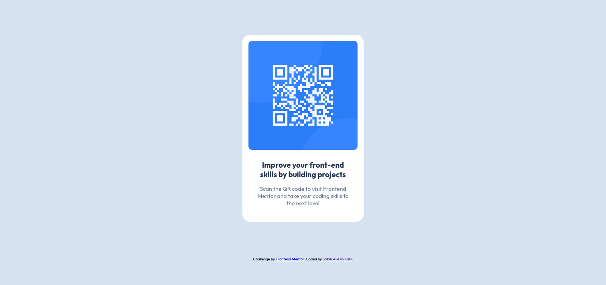

# Frontend Mentor - QR Code Component Solution

This is my solution to the [QR Code Component Challenge on Frontend Mentor](https://www.frontendmentor.io/challenges/qr-code-component-iux_sIO_H). Completing this challenge allowed me to sharpen my coding skills by building a realistic and practical project.

---

## Table of Contents

- [Overview](#overview)
  - [Screenshot](#screenshot)
  - [Links](#links)
- [My Process](#my-process)
  - [Built With](#built-with)
  - [What I Learned](#what-i-learned)
  - [Continued Development](#continued-development)
- [Author](#author)
- [Acknowledgments](#acknowledgments)

---

## Overview

### Screenshot



### Links

- **Live Site URL:** [Live deom](https://filostkana-qr-code.vercel.app/)

---

## My Process

### Built With

- Semantic HTML5 markup
- CSS custom properties
- Flexbox
- [SCSS](https://sass-lang.com) - A CSS extension language
- Mobile-first workflow

### What I Learned

This was my first complete project that I built on my own. Throughout this process, I learned a lot about real-world frontend development workflows and project structures. Here are the key takeaways:

- **Improved Workflow Understanding:** I gained a better understanding of how frontend development is structured and implemented in real-world scenarios.
- **Introduction to Sass:** This was my first experience using Sass instead of plain CSS. I learned about Sass syntax and how to compile it using the Live Sass Compiler extension in VS Code. Here's an example of how I used Sass in my project:

```scss
.content-box {
  padding: 0 1.6rem;
  margin: 2.4rem auto 0;

  &__header {
    font-weight: 700;
    font-size: 2rem;
    margin-bottom: 1.6rem;
    color: $slate-900;
  }

  &__body {
    font-weight: 400;
    font-size: 1.5rem;
    color: $slate-500;
  }
}
```
- **Using Figma:** I worked with Figma for the first time to analyze the design files, which helped me understand how to translate designs into code effectively.


### Continued development

Moving forward, I plan to:

  -  Continue improving my skills in HTML, CSS, and Sass.
  -  Focus more on development workflows to enhance my efficiency and productivity.
  -  Take on more challenging projects to solidify my knowledge and gain practical experience.


## Author

- Frontend Mentor - [@filostkana](https://www.frontendmentor.io/profile/filostkana)
- Twitter - [@filostkana](https://www.twitter.com/filostkana)


## Acknowledgments

I want to express my gratitude to [frontend mentor](https://www.frontendmentor.io) for providing the frontend development community with such an excellent resource. Their challenges offer a fantastic way to learn and grow as a developer.

